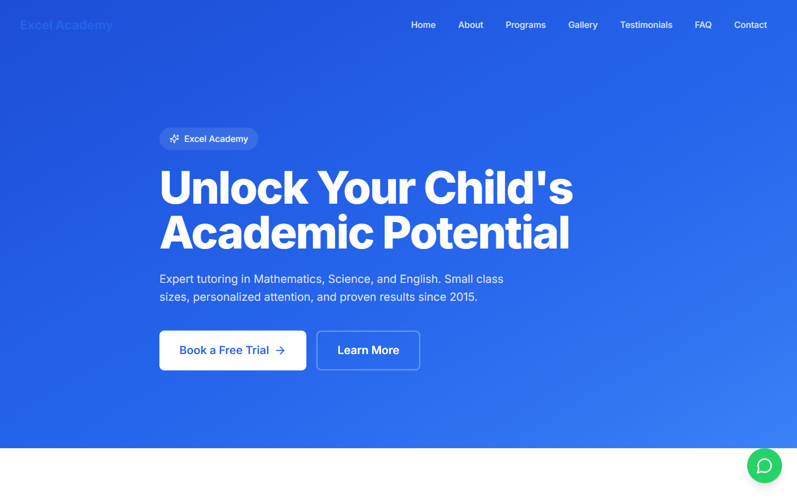
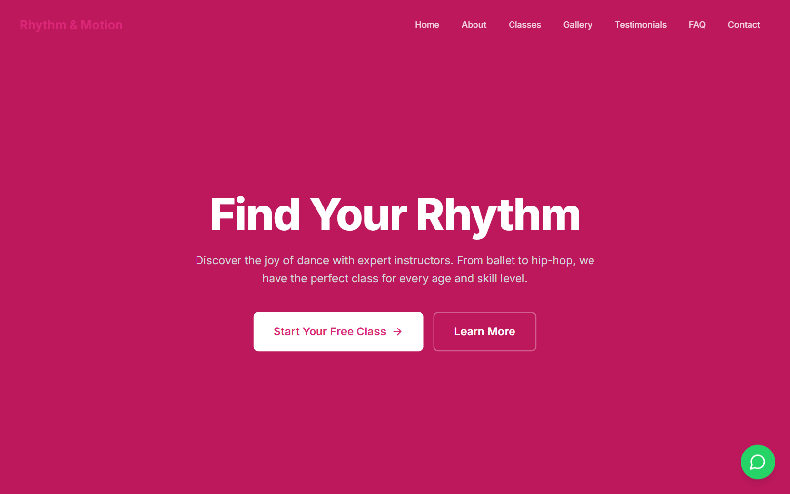
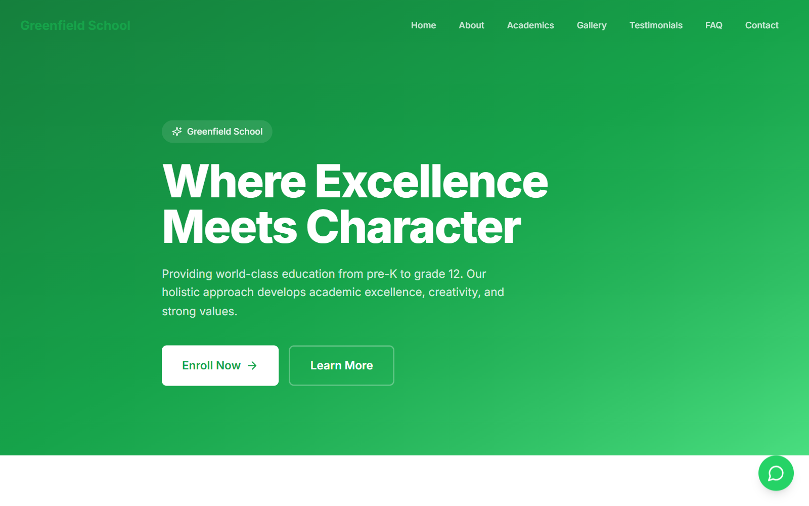
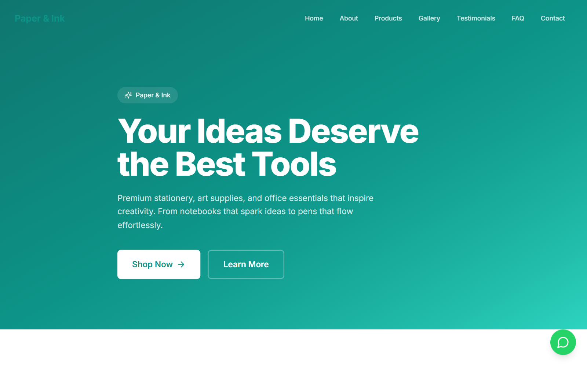
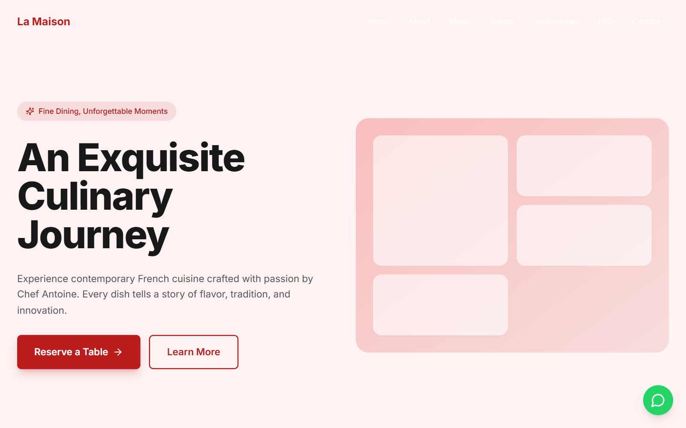
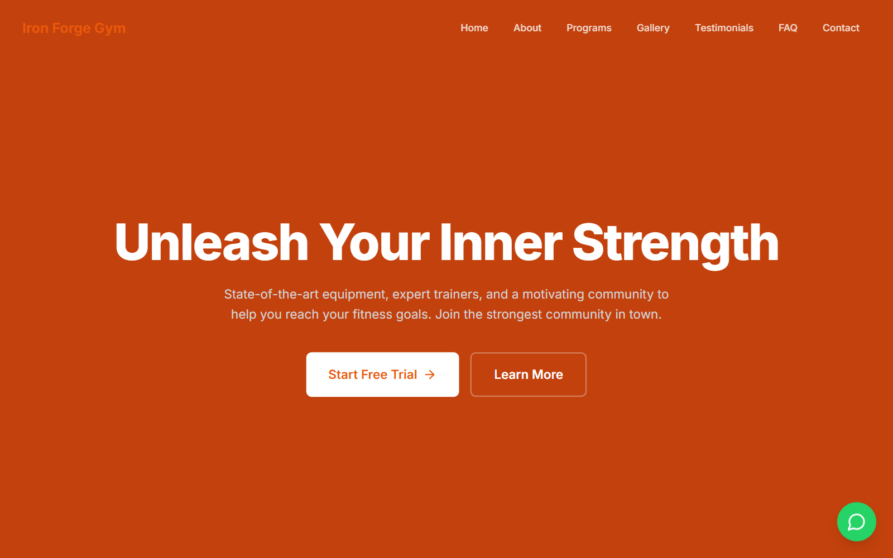
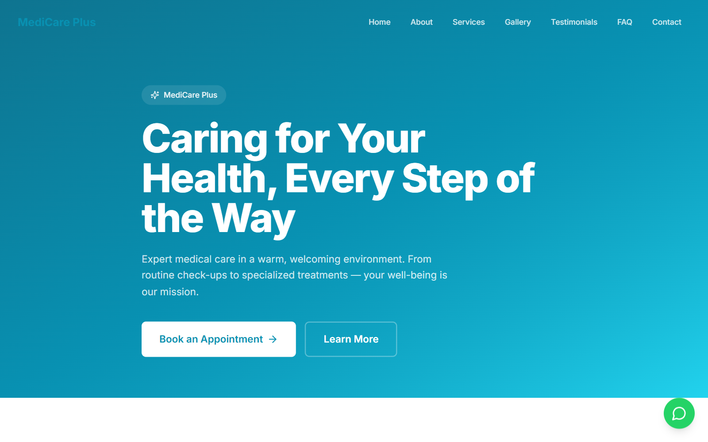
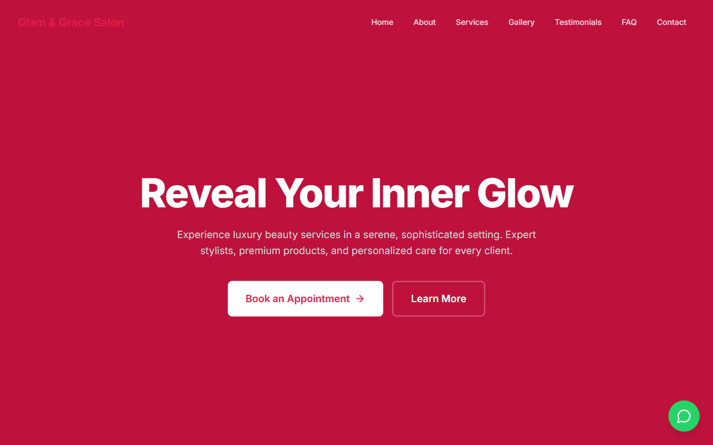
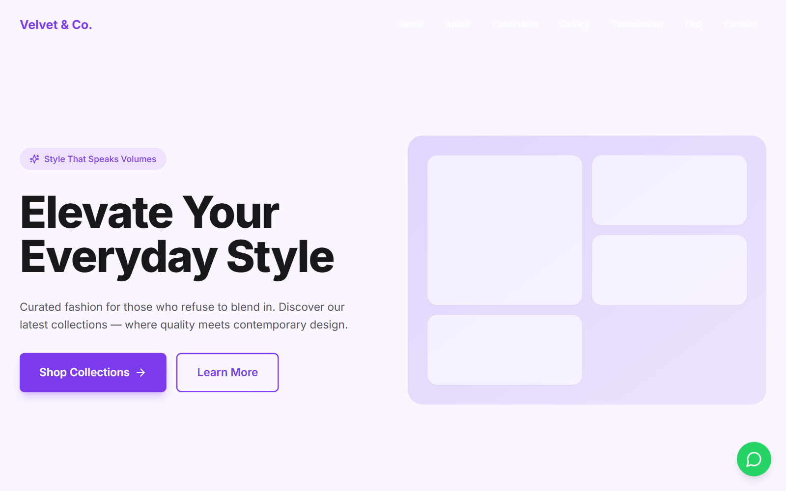

# Website Templates 🚀

A production-ready collection of **10 professional website templates** for local businesses. Built with **React 18**, **Vite 5**, and **Tailwind CSS 3**.

| Template | Preview |
|----------|---------|
| 🎓 Tuition Center |  |
| 💃 Dance Academy |  |
| 🏫 School |  |
| ✏️ Stationery Shop |  |
| 🍽️ Restaurant |  |
| 💪 Gym |  |
| 🏥 Medical Clinic |  |
| 💇 Salon |  |
| 👗 Clothing Store |  |
| 📱 Electronics Shop |  |

---

## ✨ Features

- **10 Industry Templates** — each with unique styling and content
- **Complete Page Sections** — Hero, About, Services, Gallery, Testimonials, FAQ, Contact Form, Google Maps, WhatsApp, Footer
- **Modern Tech Stack** — React 18 + Vite 5 + Tailwind CSS 3
- **Fully Responsive** — Mobile-first, works on all devices
- **CSS Theme System** — each template gets its own color palette
- **Smooth Animations** — scroll-reveal effects, image lightbox, accordion FAQ
- **SEO Friendly** — semantic HTML, meta tags, fast 53KB gzipped load
- **One-Click Deploy** — ready for Vercel

---

## 🚀 Quick Start

```bash
git clone https://github.com/projectalphaalford-cmd/website-templates.git
cd website-templates
npm install
npm run dev
```

Open **http://localhost:3000** — browse all templates from the gallery.

---

## 🗂️ Project Structure

```
website-templates/
├── src/
│   ├── components/
│   │   ├── ui/              # Reusable primitives
│   │   │   ├── Button.jsx       # Primary, outline, ghost variants
│   │   │   ├── Card.jsx         # Shadow card with hover lift
│   │   │   ├── Container.jsx    # Max-width centered wrapper
│   │   │   ├── Input.jsx        # Form input + textarea
│   │   │   └── SectionHeading.jsx  # Section title + divider
│   │   └── sections/        # Page section components
│   │       ├── Navbar.jsx        # Fixed top nav, mobile hamburger
│   │       ├── HeroSection.jsx   # 3 layout variants
│   │       ├── AboutSection.jsx   # Image + text or stats-only
│   │       ├── ServicesSection.jsx # Grid or list layout
│   │       ├── GallerySection.jsx  # Grid/masonry + lightbox + filter
│   │       ├── TestimonialsSection.jsx # Grid or carousel + stars
│   │       ├── FaqSection.jsx    # Accordion
│   │       ├── ContactSection.jsx  # Form + info cards
│   │       ├── GoogleMapsSection.jsx # Embedded map placeholder
│   │       ├── FooterSection.jsx  # Links + social + copyright
│   │       └── WhatsAppButton.jsx  # Fixed floating button
│   ├── templates/           # ★ EDIT HERE to customize content
│   │   ├── tuition-center/data.js
│   │   ├── dance-academy/data.js
│   │   ├── school/data.js
│   │   ├── stationery/data.js
│   │   ├── restaurant/data.js
│   │   ├── gym/data.js
│   │   ├── medical-clinic/data.js
│   │   ├── salon/data.js
│   │   ├── clothing-store/data.js
│   │   └── electronics/data.js
│   ├── hooks/               # useInView (scroll animations)
│   ├── pages/
│   │   ├── Home.jsx             # Template gallery landing page
│   │   └── TemplatePage.jsx     # Template renderer
│   ├── App.jsx              # Router
│   ├── main.jsx             # Entry
│   └── index.css            # ★ EDIT HERE to change colors
├── screenshots/             # Template preview images
├── vercel.json              # Vercel deployment config
├── tailwind.config.js
├── vite.config.js
└── package.json
```

---

## 🎨 How to Customize Each Template

### 1. Change Business Name, Text, Phone, Address

Each template has a data file in `src/templates/<template-name>/data.js`. Open it and edit:

```js
// Example: src/templates/restaurant/data.js
export const brand = {
  name: 'Your Restaurant Name',          // ← Change this
  tagline: 'Your Tagline',
};

export const hero = {
  title: 'Your Headline',                // ← Change this
  subtitle: 'Your description here...',
  cta: { text: 'Book a Table', href: '#contact' },
};

export const contact = {
  email: 'you@example.com',              // ← Change this
  phone: '+1 (555) 000-0000',            // ← Change this
  address: 'Your Address',
};

export const whatsapp = {
  phone: '+15550000000',                 // ← Change this (numbers only)
  message: 'Hi! I want to book.',
};

export const mapAddress = 'Your Address Here';  // ← For Google Maps
```

### 2. Change Colors

Edit `src/index.css`. Each template has a theme class:

```css
/* Find and edit the theme block for your template */
.theme-restaurant {
  --color-brand: 185 28 28;        /* RGB values - primary color */
  --color-brand-light: 239 68 68;  /* lighter variant */
  --color-brand-dark: 153 27 27;   /* darker variant */
  --color-brand-muted: 254 202 202; /* pastel/background tint */
  --color-surface: 255 255 255;    /* card/background white */
  --color-surface-alt: 254 242 242; /* alternate section bg */
}
```

To find the right RGB values for a hex color like `#E11D48`:
1. Convert hex to RGB: `E1=225, 1D=29, 48=72` → `225 29 72`
2. Replace the values in the CSS

### 3. Change Services/Pricing

```js
export const services = {
  title: 'Our Menu',
  subtitle: 'Crafted with love',
  items: [
    { icon: SomeIcon, title: 'Item Name',
      description: 'Item description...',
      price: '$10-$50' },            // ← Change prices
  ],
};
```

Available icons: all [Lucide icons](https://lucide.dev/icons/). Import at the top of the data file.

### 4. Change Gallery Images

The templates use gradient placeholders. To add real images, edit the section component or replace the gradient divs with `` tags.

### 5. Change Testimonials

```js
export const testimonials = {
  items: [
    { name: 'Customer Name',
      role: 'Title',
      content: 'Review text...',
      rating: 5 },                 // ← 1-5 stars
  ],
};
```

### 6. Change FAQ

```js
export const faq = {
  items: [
    { question: 'Your question?', answer: 'Your answer...' },
  ],
};
```

### 7. Change Layout Variants

Each template can use different visual layouts by setting these exports in its data file:

| Export | Options | Effect |
|--------|---------|--------|
| `heroVariant` | `'default'`, `'centered'`, `'split'` | Hero section layout |
| `aboutVariant` | `'default'`, `'minimal'`, `'image-right'` | About section layout |
| `servicesVariant` | `'grid'`, `'list'` | Services display |
| `galleryVariant` | `'grid'`, `'masonry'` | Gallery layout |
| `testimonialsVariant` | `'grid'`, `'carousel'` | Testimonials display |
| `contactVariant` | `'default'`, `'minimal'` | Contact section layout |

### 8. Change Social Links

```js
export const social = {
  facebook: 'https://facebook.com/yourpage',
  instagram: 'https://instagram.com/yourhandle',
  // Supported: facebook, instagram, twitter, youtube, linkedin, github
};
```

### 9. Add/Remove Nav Links

```js
export const navLinks = [
  { label: 'Home', href: '#home' },
  { label: 'About', href: '#about' },
  // Add or remove items here
];
```

---

## 🌐 Routes

| Route | What it shows |
|-------|---------------|
| `/` | Gallery landing page with all templates |
| `/template/tuition-center` | Tuition Center template |
| `/template/dance-academy` | Dance Academy template |
| `/template/school` | School template |
| `/template/stationery` | Stationery Shop template |
| `/template/restaurant` | Restaurant template |
| `/template/gym` | Gym & Fitness template |
| `/template/medical-clinic` | Medical Clinic template |
| `/template/salon` | Salon & Beauty template |
| `/template/clothing-store` | Clothing Store template |
| `/template/electronics` | Electronics Shop template |

---

## 📦 Deploy to Vercel

### Option 1: CLI

```bash
npm i -g vercel
vercel --prod
```

### Option 2: Git Import

1. Push to GitHub
2. Go to [vercel.com/new](https://vercel.com/new)
3. Import `projectalphaalford-cmd/website-templates`
4. Vercel auto-detects Vite — click **Deploy**

After deployment, each template is live at:
`https://your-project.vercel.app/template/restaurant`

---

## 🛠️ Tech Stack

| Tool | Version | Purpose |
|------|---------|---------|
| React | 18.3 | UI framework |
| Vite | 5.4 | Build tool |
| Tailwind CSS | 3.4 | Styling |
| React Router | 6.23 | Client-side routing |
| Lucide React | 0.379 | Icons |

---

## 📄 License

MIT — Free to use for personal and commercial projects.
